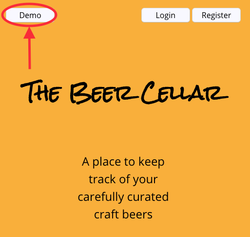
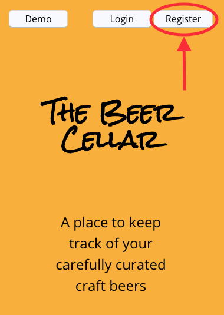
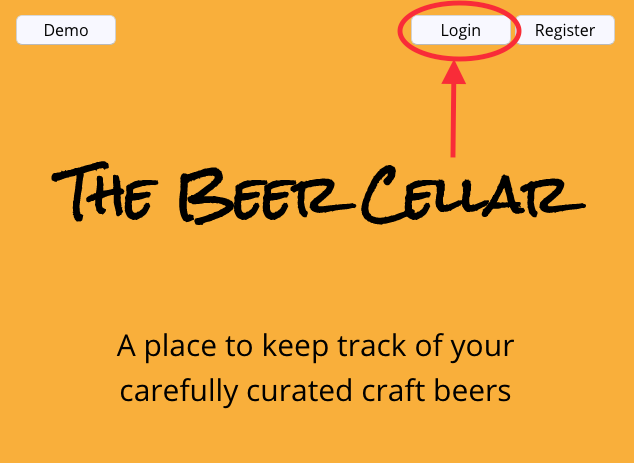
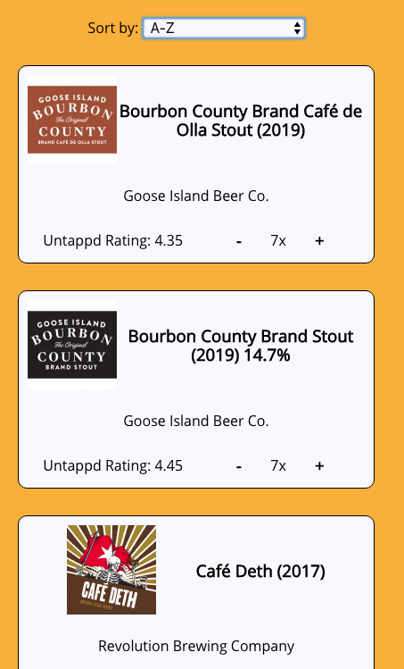
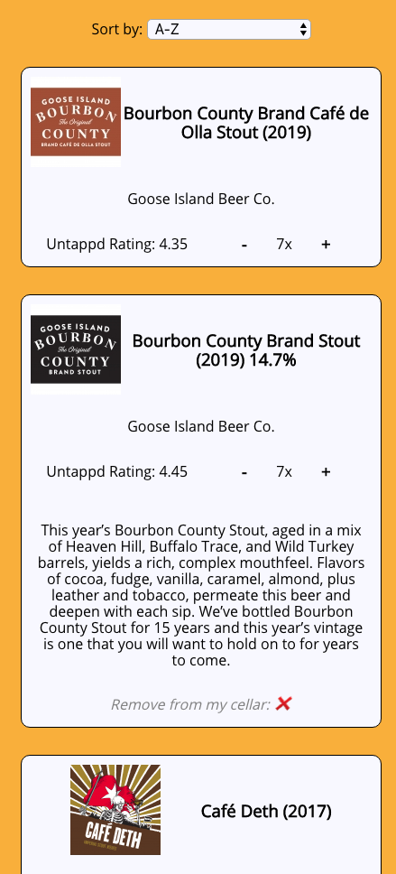
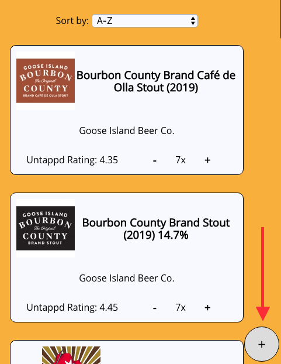
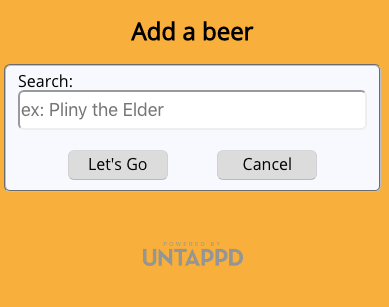
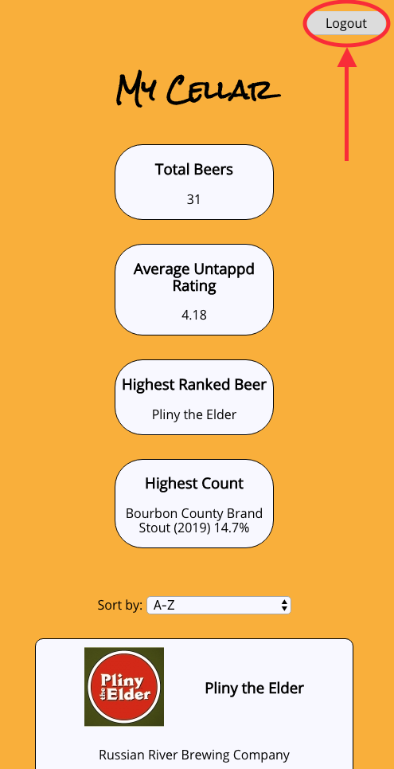

# The Beer Cellar

A place to store your carefully curated craft beers.

## Live Application

Visit [The Beer Cellar](https://the-beer-cellar-app.now.sh/)

## Instructions

**To run the app in demo mode** click the demo button in the upper left corner.

*Note:* This data is not permanently stored.

**Register a new account**

Click on the register button in the upper right corner of the screen and fill out the form.

**If you already have an account, log in**

### The Dashboard

When you first login, you'll see a dashboard of your cellar. This is high-level information that includes the total number of bottles in your cellar, your cellar's average Untappd rating (out of 5), your beer with the highest rating, and the beer of which you have the most.

### The Cellar

Below the dashboard, you'll see a list of your beers. You can use the sort bar to sort them alphabetically, by quantity, or by Untappd rating.

Click on an individual item to see it expand for more info on the beer (and to have the option to delete the beer).

**Click** on the `+` or `-` buttons adjacent to a beer's quantity to adjust the amount in your cellar

**Click** on the ❌ in the expanded view to delete the beer from your cellar completely.

**Click** on the add button if you want to add a beer to your cellar.

This search form is powered by Untappd and pulls useful community data about virtually any produced beer worldwide. Type in any search term to look for a beer to add to your cellar.

### Logout

To logout at any point. Click on the `Logout` button in the upper right hand corner of the main page.

### Developed by Zachary Zboncak (zachary.zboncak@gmail.com)

### Technologies used

**Client-side:**
- [React.js](https://reactjs.org/)
- [HTML](https://en.wikipedia.org/wiki/HTML)
- [CSS](https://en.wikipedia.org/wiki/Cascading_Style_Sheets)
- [Javascript](https://en.wikipedia.org/wiki/JavaScript)

**Server-side: [The Beer Cellar API](https://github.com/zzboncak/the-beer-cellar-api)**
- [Node.js](https://nodejs.org/en/)
- [Request](https://github.com/request/request)
- [Express](https://expressjs.com/)
- [PostgreSQL](https://www.postgresql.org/)

Powered by [Untappd](https://untappd.com/api/docs)